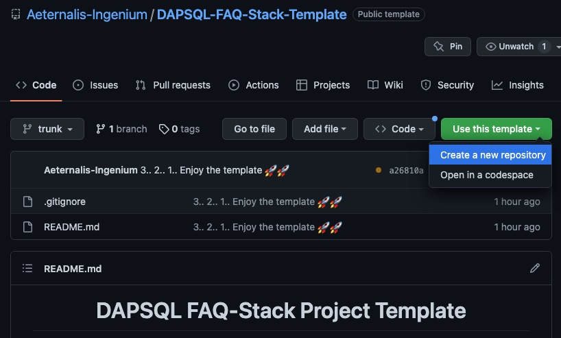

<h1 align=center><strong>DAPSQL FAQ-Stack Project Template</strong></h1>

This is a template repository aimed to kick start your project in the most comprehensive way! The documentation in this `README` assumed that you are a beginner who are eager to learn by doing and mistakes, thus you need to read the technologies mentioned below on your own since this repository will only walk your through the code for the setup.

Now, let's disect the weird abbreviation from this repository title **DAQSQL FAQ** which stands for:

* [Dockerized](https://www.docker.com/)
* [Asynchronous PostgreSQL](https://www.postgresql.org/docs/current/libpq-async.html)
* [FastAPI](https://fastapi.tiangolo.com/)
* [Qwik](https://qwik.builder.io/)

## What is with this weird Stack?

Well, the easy anser is Speed! And by speed I mean "the Flash type of speed"!

* **FastAPI** is crowned as the fastest web framework for Python and thus we use it for our backend development.
* Meanwhile, **Qwik** is a young web framework written in Java Script that offers the fastest possile page load times regardless the complexity of our website! Check them both in the above link.
* The database of my choice is the **asynchronous** version of **PostgreSQL** (via [SQLAlchemy 2.0](https://docs.sqlalchemy.org/en/20/orm/extensions/asyncio.html)). Why asynchronous? Well.. Speed! Read [this blog from Packt](https://subscription.packtpub.com/book/programming/9781838821135/6/ch06lvl1sec32/synchronous-asynchronous-and-threaded-execution) if you want to educate yourself further about the topic **Asynchronous, Synchronous, Concurrency,** and **Parallelism**.
* And **Docker** is the technology that will hold your team together because your app will live in a container where the gravity of your personal machine specs don't matter anymore!

The main template in this repository is the `backend/` and `frontend/` directories.

## Other Technology

The above listed technologies are just the main ones. There are other technologies utilized in this project template to ensure that your application is robust and provides the best-possible development environment for your team! These technologies are:

* [TOML](https://toml.io/en/) $\rightarrow$ The one-for-all configuration file. This makes it simpler to setup our project.
* [Pyenv](https://github.com/pyenv/pyenv) $\rightarrow$ The simplest way to manage our Python versions.
* [Pyenv-VirtualEnv](https://github.com/pyenv/pyenv-virtualenv) $\rightarrow$ The plugin for `Pyenv` to manage the virtual environment for our packages.
* [PNPM](https://pnpm.io/) $\rightarrow$ This is `NPM` + `Yarn` on steroid. The highly-enhanced version of `NPM` which is `JavaScript` framework manager like `Pyenv` for python.
* [Pre-Commit](https://pre-commit.com/) $\rightarrow$ Git hook scripts to identify issues and quality of your code before pushing it to GitHub. These hooks are implemented for the following linting pakcages:
  * [Black (Python)](https://black.readthedocs.io/en/stable/) $\rightarrow$ Manage your code style with auto formatting and parallel continuous integration runner for Python.
  * [Isort (Python)](https://pycqa.github.io/isort/) $\rightarrow$ Sort your `import` for clarity. Also for Python. 
  * [MyPy (Python)](https://mypy.readthedocs.io/en/stable/) $\rightarrow$ A static type checker for Python that helps you write a cleaner code.
  * [ESLint (JavaScript)](https://eslint.org/) $\rightarrow$ Analyze your code for JavaScript.
* [Pre-Commit CI](https://pre-commit.ci/) $\rightarrow$ Continuous integration for our Pre-Commit hook that fixes and updates our hook versions.
* [Prettier](https://prettier.io/) $\rightarrow$ Format your JavaScript code to be more **prettier** 😜.
* [Husky](https://typicode.github.io/husky/#/) $\rightarrow$ Lint your commit messages, run tests, and javascript code.
* [CodeCov](https://about.codecov.io/) $\rightarrow$ A platform that analyze the result of your automated tests.
* [PyTest](https://docs.pytest.org/en/7.2.x/) $\rightarrow$ The testing framework for Python code.
* [JEST](https://jestjs.io/) $\rightarrow$ The testing framework for JavaScript code.
* [DBDiagram](https://dbdiagram.io/home) $\rightarrow$ A platform that lets your design your database by writing SQL and converting it into ERD. This paltform provides a complete symbol for entity relationships (not like many other platforms!).
* [GitHub Actions](https://github.com/features/actions) $\rightarrow$ The platform to setup our CI/CD by GitHub.
* [SQLAlchemy 2.0](https://docs.sqlalchemy.org/en/20/orm/extensions/asyncio.html) $\rightarrow$ The go-to database interface library for Python. The 2.0 is the most recent update where it provides asynchronous setup.
* [CODEOWNER](https://docs.github.com/en/repositories/managing-your-repositorys-settings-and-features/customizing-your-repository/about-code-owners) $\rightarrow$ A file for distributing the responsibilities in our project to each team/team mate.

The choice for my project development worklow is usually the [Trund-Based Development](https://trunkbaseddevelopment.com/), hence the name `trunk` for the main branch repositury instead of `master` or `main`.

## Walk-Through

To read the walk-through, please refer to the following folders in `./Template-Guide`:

* [Step 1](https://github.com/Aeternalis-Ingenium/DAPSQL-FAQ-Stack-Template/Template-Guide/Step1/README.md) $\rightarrow$ `Python` setup, `.gitignore`, `.dockerignore`, `dotev`, `README`.

## Using this Template

To use this template click "use this template" and choose "crete new repository", just like the image below. After you have your own repository, you can change the `README` file and delete the `Template-Guide` directory.

