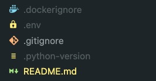

<h1 align=center><strong>Preparation Workflow</strong></h1>

Before doing the `initial commit`, we need to prepare the initial project setup. This section is divided into 2 parts:

* Python Setup
* The Initial 4 Files

## Python Setup

* Create and go into your project directory

  * `mdkir YOUR/PATH/TO/PROJECT/DIR && cd YOUR/PATH/TO/PROJECT/DIR`

* Install the wanted Python version (I always aim to the most recent one) and create your virtual environment:

    * `pyenv install 3.11.0`
    * `pyenv virtualenv 3.11.0 YOUR_VENV_NAME`

* Set the newly created virtual environment as your main Python interpreter:

    * `pyenv local YOUR_VENV_NAME`

* Install our initial project requirements with PIP3:

    * `pip3 install YOUR_PACKAGE` or use my requirements.txt in the `backend/` directory via
    * `pip3 install -r requirements.txt` (make sure you are in the `backend/` directory)

The packages for our Python app are as follow:

```
alembic
asyncpg
black
colorama
email-validator
fastapi
greenlet
httpx
isort
loguru
mypy
pathlib
pre-commit
python-dotenv
python-decouple
python-jose
python-slugify
pytest
pytest-asyncio
pytest-cov
pytest-xdist
sqlalchemy
uvicorn
```

## The Initial 4 Files

Create the following files:

* `.gitignore`
* `.dockerignore`
* `.env`
* `README.md`

### Gitignore

The main function is to hide folders and files that store either little importance code, local settings code, or highly secretive code. Some of these folders and files are as follow:

```
# Byte-compiled, optimized, and DLL files
__pycache__/
*.py[cod]
*$py.class

# C/C++ production directory
/build
*/build
*.so

# Cache
.cache
.pytest_cache/
.webassets-cache
.mypy_cache/
`
# Celery (Python's asynchronous task queues framework)
celerybeat-schedule

# Code editor (IntelliJ & VSCode)
*.iml
*.ipr
*.iws
.idea/
.classpath
.project
.settings/
.vscode/

# Container
.dockerignore

# Database-related
*.sqlite3
*.db
postgres-data

# Distributions package
.Python
build/
develop-eggs/
dist/
downloads/
eggs/
.eggs/
lib/
lib64/
parts/
sdist/
var/
wheels/
*.egg-info/
.installed.cfg
*.egg
MANIFEST

# Documentation
/site
docs/_build/

# Dotenvs
/.pnp
.pnp.js
.env
env/
ENV/
env.bak/
prod_env/
dev_env/
test_env/
test.env
dev.env
prod.env
.DS_Store
.env.local
.env.development.local
.env.test.local
.env.production.local

# Flutter
*.class
*.lock
*.log
*.pyc
*.swp
.atom/
.buildlog/
.history
.svn/

# Jupyter Notebook
.ipynb_checkpoints

# Log files
pip-log.txt
pip-delete-this-directory.txt
*.log
npm-debug.log*
yarn-debug.log*
yarn-error.log*

# Project settings
local_settings.py
instance/
.spyderproject
.spyproject
.ropeproject

# PyInstaller
*.manifest
*.spec

# Rust compiled file
target/

# SageMath (Python#s open-source mathematics framework)
*.sage.py

# Scraping tool
.scrapy

# Translations:
*.mo
*.pot

# Unit test and coverage reports:
htmlcov/
.tox/
.coverage
.coverage.*
coverage/
nosetests.xml
coverage.xml
*.cover
.hypothesis/

# Virtual Environment & packages
.python-version
.venv
venv/
venv.bak/
*/node_modules/
node_modules/

```

### Dockerignore

this file has the same functionality as `.gitignore` file for our `Docker` container. Some folders and files to be listed here are as follow:

```
.mypy_cache
.pytest_cache
__pycache__
coverage
.coverage
.gitignore
.github
*.md
env
.dockerignore
Dockerfile
Dockerfile.prod
docker-compose.yaml
.eslintrc.js
requirements-build.txt
requirements-lint.txt
requirements-test.txt
requirements-dev.txt
requirements-prod.txt
```

### DotEnv

This file is the one responsible for credential variables for the web application. It is used for both the `Python`/`FastAPI` backend app and the `JavaScript`-based `React JS` frontend app. Some starting variables for our `.env` file are as follow:

```
ENVIRONMENT=DEV
DEBUG=True
POSTGRES_DB=any_name_db
POSTGRES_HOST=your_postgres_image_name
POSTGRES_PASSWORD=anypassword123!
POSTGRES_PORT=5432
POSTGRES_SCHEMA=postgresql
POSTGRES_USERNAME=anyusername
POSTGRES_URI={POSTGRES_SCHEMA}://{POSTGRES_USERNAME}:{POSTGRES_PASSWORD}@{POSTGRES_HOST}:{POSTGRES_PORT}/{POSTGRES_DB}
BACKEND_SERVER_HOST=0.0.0.0
BACKEND_SERVER_PORT=8000
DB_TIMEOUT=5
DB_POOL_SIZE=500
DB_MAX_POOL_CON=450
DB_POOL_OVERFLOW=50
IS_DB_ECHO_LOG=True
IS_DB_EXPIRE_ON_COMMIT=False
IS_DB_FORCE_ROLLBACK=True
IS_ALLOWED_CREDENTIALS=True
API_TOKEN=YOUR-API-TOKEN
AUTH_TOKEN=YOUR-AUTHENTICATION-TOKEN
JWT_TOKEN_PREFIX=YOUR-TOKEN-PREFIX
```

### README

This `MarkDown` file is for documenting all about the developed web application. To start, let's just add the title and sub-title as follow:

```
<h1 align=center><strong>Title</strong></h1>

<h3 align=center><strong>Sub-Title</strong>osftware</h3>

```

After your root directory look like the below image, we can proceed to make our initial commit from our chosen VCS platform (GitHub is my to go platform).


